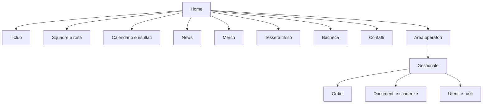
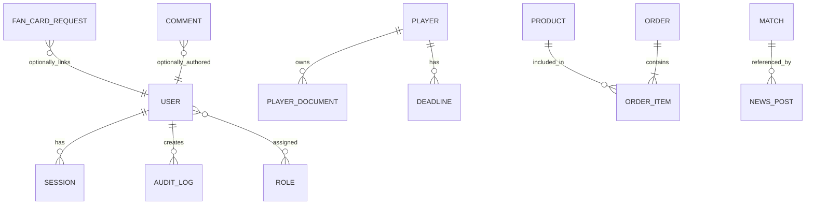

# Capraia Football Club — piano operativo

> Stato: prototipo statico. Le informazioni di partita, rosa e prodotti sono contenuto dimostrativo, non dati ufficiali.

## 1. Direzione creativa e marketing

### Brand provvisorio

| Elemento | Scelta | Uso |
|---|---|---|
| Blu Capraia | `#002F86` | Fondo principale, titoli, pannello staff |
| Giallo gialloblù | `#FFD21C` | Call to action, dettagli e campi da gioco |
| Arancio crest | `#F28C00` | Accenti e date importanti |
| Bianco | `#FFFFFF` | Fondo pagina e testi su scuro |
| Titoli | Fraunces | Calore editoriale, identità locale |
| Testo | DM Sans | Leggibilità su mobile |
| Microcopy | DM Mono | Risultati, date, stato ordini |

Lo stemma presente in `assets/capraiafc-original.png` è quello pubblico associato a Capraia Football Club. Il linguaggio è diretto, inclusivo e territoriale: comunità prima del risultato, energia di gara senza retorica.

### SEO homepage

- **Meta title:** Capraia Football Club | Squadra, partite e comunità
- **Meta description:** Segui Capraia Football Club: partite, news, squadra, tessera del tifoso e merchandising ufficiale. Tutta la passione gialloblù.

### Hero: headline alternative da approvare

1. Qui si gioca con il cuore.
2. Un'isola. Una squadra. Tutto da vivere.
3. Il verde che ci unisce.

### CTA consigliate

- Scopri la prossima partita
- Richiedi la tessera del tifoso
- Indossa i nostri colori
- Segui la squadra su Instagram
- Sostieni il club

### Calendario editoriale, primi 3 mesi

| Mese | Contenuto | Canale | CTA |
|---|---|---|---|
| 1 | Presentazione rosa e staff | Sito, Instagram, newsletter | Conosci la squadra |
| 1 | Anteprima prima gara | Sito, Stories | Aggiungi al calendario |
| 1 | Lancio tessera tifoso | Sito, feed, newsletter | Richiedi la tessera |
| 2 | Recap gara con foto e risultato | News, Instagram | Leggi la cronaca |
| 2 | Storia di un volontario/tifoso | News, newsletter | Entra nella comunità |
| 2 | Nuova capsule merch | Shop, Instagram | Vai allo shop |
| 3 | Calendario del mese | Sito, newsletter | Non perdere una partita |
| 3 | Intervista a un giocatore | News, Reels | Scopri la sua storia |
| 3 | Invito a evento del club | Sito, Instagram | Partecipa all'evento |

### Instagram

Non sono emersi risultati pubblici interrogabili per `@capraiafc`; nessun contenuto Instagram è stato copiato, scaricato o attribuito impropriamente. Collegare il feed solo con l'autorizzazione dell'account Meta e mostrare al massimo 6 post recenti, con link al post originale e alt text redatti dallo staff. Per le immagini, preparare 12 asset autorizzati: 2 hero `1600×900`, 4 card `600×400`, 4 quadrati feed `1080×1080`, 2 ritratti `800×1000`. Usare WebP/AVIF, taglio focalizzato sul soggetto e attribuzione quando necessaria.

## 2. Sitemap e percorsi



| Azione | Percorso utente |
|---|---|
| Trovare una gara | Home → prossima partita → calendario → dettaglio partita → aggiungi al calendario |
| Acquistare merch | Merch → prodotto → carrello → checkout Stripe/PayPal → conferma email |
| Richiedere tessera | Home/CTA → tessera → consenso privacy → invio → ricevuta email → verifica segreteria |
| Lasciare commento | Bacheca → messaggio → controllo antispam → coda moderazione → pubblicazione/rifiuto |

### Form: campi minimi

| Form | Campi | Note |
|---|---|---|
| Tessera tifoso | nome, cognome, email, città facoltativa, consenso privacy, consenso newsletter facoltativo | Non chiedere documento o data di nascita finché non strettamente necessario |
| Checkout | gestito da Stripe/PayPal | Non memorizzare dati carta |
| Bacheca | nome visualizzato facoltativo, email non pubblica, messaggio, consenso regole | Rate limit + captcha invisibile |
| Contatti | nome, email, oggetto, messaggio, consenso privacy | Risposta entro SLA definito |
| Operatore | email, password, OTP 2FA | Solo invito da admin |

## 3. Pannello operatori e sicurezza

### Matrice ruoli

| Funzione | Visitatore | Tifoso registrato | Segreteria | Dirigente | Medico | Magazziniere | Admin |
|---|---:|---:|---:|---:|---:|---:|---:|
| Leggere contenuti pubblici | ✓ | ✓ | ✓ | ✓ | ✓ | ✓ | ✓ |
| Richiedere tessera/commentare | ✓ | ✓ | ✓ | ✓ | ✓ | ✓ | ✓ |
| Approvare tessere e commenti | — | — | C/M | C/M | — | — | C/M |
| Gestire gare e news | — | — | C/M | C/M/D | — | — | C/M/D |
| Gestire ordini | — | — | R | R | — | C/M | C/M/D |
| Vedere documenti atleti | — | — | R | R | C/M | — | C/M/D |
| Gestire visite mediche | — | — | R | R | C/M | — | C/M/D |
| Gestire utenti e ruoli | — | — | — | R | — | — | C/M/D |

Legenda: R = lettura, C = crea, M = modifica, D = cancella. Applicare il principio del privilegio minimo: il magazziniere non vede documenti sanitari; il medico non gestisce pagamenti o ordini.

### Wireframe admin

```text
┌────────────────────────────────────────────────────────────┐
│ capraia.     Dashboard · Gare · Tessere · Ordini · Persone │
├──────────┬─────────────────────────────────────────────────┤
│ Menu     │ Buongiorno, Segreteria                           │
│ Dashboard│ [3 scadenze] [8 tessere] [2 ordini da spedire]  │
│ Atleti   │                                                 │
│ Scadenze │ Prossime azioni                                 │
│ Documenti│ • Visita medica Marco Rossi      7 giorni       │
│ Merch    │ • Ordine CP-1024                 oggi           │
│ Bacheca  │ • Certificato da verificare      1 giorno       │
└──────────┴─────────────────────────────────────────────────┘
```

### Autenticazione proposta

- Accesso operatori: Supabase Auth o Auth.js, password forte + TOTP obbligatorio, invito via email e verifica dominio/indirizzo autorizzato.
- Sessione: access token JWT breve (15 minuti) in memoria/cookie `HttpOnly Secure SameSite=Lax`; refresh token ruotato e revocabile (30 giorni).
- OAuth2 solo per integrazioni autorizzate (Meta, Google Calendar), con scope minimo e token cifrati a riposo.
- Password: minimo 12 caratteri, blocco password compromesse, reset monouso con durata 30 minuti; mai loggare password o token.
- Sicurezza: rate limit su login, commenti e tessera; CAPTCHA invisibile nei form pubblici; audit log immutabile per operazioni staff; alert su logins anomali e 5 fallimenti consecutivi.

Esempio middleware (pseudocodice):

```ts
export async function requireRole(request, allowed: Role[]) {
  const session = await auth.verify(request.cookies.accessToken)
  if (!session) throw new ApiError(401, 'Autenticazione richiesta')
  if (!allowed.includes(session.role)) throw new ApiError(403, 'Permesso insufficiente')
  return session
}
```

## 4. API principale

Tutte le API sono HTTPS, JSON, con validazione schema lato server. Convenzione risposte: `{ data, meta }`; errori: `{ error: { code, message, requestId } }`.

| Metodo e endpoint | Accesso | Input / output sintetico |
|---|---|---|
| `POST /api/auth/login` | pubblico | email, password, OTP → sessione sicura |
| `POST /api/auth/refresh` | cookie refresh | → nuovo access token, refresh ruotato |
| `POST /api/auth/logout` | autenticato | → revoca sessione |
| `POST /api/auth/forgot-password` | pubblico | email → invia link monouso |
| `GET /api/matches?from=` | pubblico | → gare pubblicate |
| `POST /api/matches` | segreteria+ | avversario, data, luogo, stato → gara |
| `PATCH /api/matches/:id` | segreteria+ | campi modificabili → gara |
| `GET/POST /api/news` | GET pubblico, POST segreteria+ | elenco / titolo, slug, corpo, immagine |
| `POST /api/fan-cards` | pubblico | dati minimi + consensi → richiesta in revisione |
| `PATCH /api/fan-cards/:id/status` | segreteria+ | `approved|rejected`, nota interna |
| `GET /api/products` | pubblico | → catalogo attivo |
| `POST /api/checkout` | pubblico | righe carrello → Stripe Checkout Session |
| `POST /api/webhooks/stripe` | Stripe firmato | → aggiorna ordine idempotentemente |
| `GET/PATCH /api/orders/:id` | staff autorizzato | → stato pagamento/spedizione |
| `POST /api/comments` | pubblico | messaggio, captcha → `pending` |
| `PATCH /api/comments/:id/moderation` | segreteria+ | `approved|rejected` |
| `POST /api/players/:id/documents` | medico/admin | file + classificazione + scadenza |
| `GET /api/deadlines?dueBefore=` | ruolo autorizzato | → scadenze filtrate per permesso |
| `POST /api/admin/reminders/run` | cron firmato | → invii da eseguire |

## 5. Modello dati



| Entità | Attributi essenziali |
|---|---|
| `users` | id, email, display_name, status, created_at |
| `roles`, `user_roles` | ruolo, scope, user_id |
| `players` | id, nome, cognome, ruolo, stato, consenso_immagine |
| `player_documents` | player_id, tipo, storage_key, expires_at, checksum, access_level |
| `deadlines` | tipo, entity_id, due_at, reminder_schedule, status, owner_role |
| `matches` | avversario, data_ora, luogo, competizione, risultato, publish_status |
| `news_posts` | titolo, slug, estratto, corpo, cover_key, publish_at, autore |
| `fan_card_requests` | dati_minimi, privacy_at, newsletter_at, status, decision_by |
| `products` | SKU, nome, prezzo_cents, taglie, stock, immagine |
| `orders`, `order_items` | provider_ref, stato, totale_cents, indirizzo cifrato, tracking |
| `comments` | corpo, autore, stato_moderazione, moderation_reason |
| `audit_logs` | actor_id, azione, entity, entity_id, ip_hash, timestamp |

## 6. Stack e deploy

**Scelta consigliata: Next.js + Supabase + Stripe + Vercel.** Offre un sito veloce, CMS/back-office su misura, auth/database/storage integrati e un deploy semplice. Contro: richiede sviluppo personalizzato e governance dei costi; non è adatto a chi vuole modificare ogni pagina senza formazione.

Alternativa: WordPress gestito + WooCommerce. Pro: editing immediato e ampia disponibilità di fornitori. Contro: manutenzione plugin, hardening maggiore e gestionale atleti da personalizzare. Strapi + React è valido per un back-office editoriale più strutturato, ma aumenta l'operatività server.

1. Hosting: Vercel (frontend/API) con dominio `ilcapraiaasd.it` da confermare.
2. Database: PostgreSQL Supabase, regione UE; migrazioni versionate.
3. File: Supabase Storage o Cloudflare R2; bucket privato per documenti sanitari con URL firmati brevi.
4. Email: Resend/Postmark per ricevute; template transazionali con unsubscribe per newsletter.
5. SMS (solo se necessario): Twilio o servizio UE, consenso esplicito e registro invii.
6. Pagamenti: Stripe Checkout; webhook con verifica firma; PayPal opzionale.
7. Backup: snapshot DB giornaliero, retention 30 giorni; export mensile cifrato; test ripristino trimestrale.
8. Monitoraggio: Sentry, uptime check, alert errori checkout/auth; `requestId` in ogni errore.

## 7. Milestone e stima (1 sviluppatore full-stack)

| Fase | Ore | Risultato |
|---|---:|---|
| Discovery, contenuti, privacy | 16–24 | Brief approvato e inventario asset |
| UX/UI e design system | 28–40 | Mockup desktop/mobile e componenti |
| Frontend pubblico | 44–60 | Home, news, partite, tessera, shop |
| Auth, ruoli e back-office | 52–72 | Area staff con audit e 2FA |
| Gestionale documenti/scadenze | 36–52 | Reminder e accesso riservato |
| Checkout, email, Instagram | 20–32 | Flussi integrati e webhook |
| QA, accessibilità, sicurezza, deploy | 28–40 | UAT, backup e go-live |
| **Totale** | **224–320** | circa 6–9 settimane a tempo pieno |

## 8. Verifiche di accettazione

| Scenario | Atteso |
|---|---|
| Visitatore invia tessera senza privacy | Blocco client e server; nessun dato persistito |
| Visitatore invia commento | Stato `pending`, non visibile al pubblico |
| Segreteria approva tessera | Stato aggiornato, email ricevuta, audit log creato |
| Operatore senza 2FA | Accesso negato all'admin |
| Medico apre documento di atleta | URL firmato, log lettura; magazziniere ottiene 403 |
| Scadenza visita fra 30/7/1 giorni | Cron crea un solo reminder per soglia e registra l'esito |
| Webhook Stripe duplicato | Ordine resta coerente grazie a chiave idempotenza |
| Navigazione tastiera | Focus visibile; menu, form e carrello utilizzabili |
| Mobile 360px | Nessun overflow orizzontale; CTA selezionabili |

## 9. Approvazioni necessarie

- Logo, stemma, font e palette ufficiali.
- Almeno 12 fotografie con autorizzazioni d'uso e liberatorie dei minori, se presenti.
- Calendario, rose, risultati, indirizzo del campo e contatti istituzionali.
- Regole, costo e requisiti della tessera tifoso; identificazione del titolare del trattamento.
- Catalogo, stock, prezzi, condizioni di vendita, rimborsi e spedizioni.
- Privacy policy, cookie policy, termini e registro consensi approvati da consulente competente.
- Ruoli effettivi del personale, tempi di conservazione documenti e canale per le emergenze mediche.
